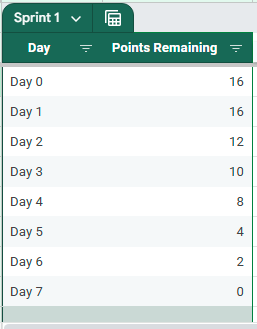

# it-support-ai-agile-planning

# IT Support AI – Agile Project

## 📋 Project Overview
Agile planning and Kanban workflow for the "IT Support AI" system that manages support tickets via chatbot, dashboard, and notification system.

## 🔗 Kanban Board Link
👉 [View the Trello Board](https://trello.com/b/GizGjBEI/it-support-ai-agile-sprint-board)

## 🗂️ Sprint 1 Backlog
- US1: Submit a support ticket
- US2: View tickets as an IT agent
- US3: Assign tickets as admin
- US8: Notify user on ticket status

## 📊 Burndown Chart

## ✅ Sprint Goal
Enable users to raise and track IT support tickets and allow agents/admins to manage them.

## 🛠️ Tools Used
- Trello for Kanban board
- Google Sheets for Burndown Chart
- GitHub for documentation
